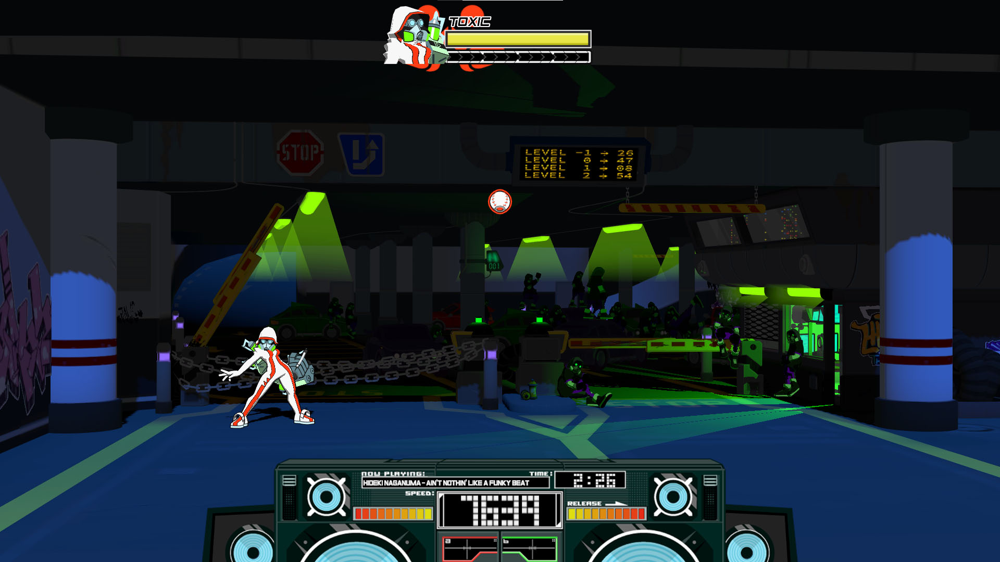

## Hive Underground

		Play in the underground Hive of the Queen (overwrite Subway).
		
## How to Install
• Install the [Stage Swapper](https://lethal-league-blaze.thunderstore.io/package/Axolotl/StageSwapper/) and it's dependencies (BepInEx and LLBML) through [r2modman](https://lethal-league-blaze.thunderstore.io/package/ebkr/r2modman/)

• Put the __**bundle**__ file and the **.xml** file inside **Steam\steamapps\common\LLBlaze\ModdingFolder\StageSwapper** folder

• Thanks to Wallace Bean, we have UI pictures of the stage for the menus

- Make a backup of your **menu_sprites** in **Steam/steamapps/common/LLBlaze/Bundles**
	
- Then overwrite it by the new **menu_sprites** bundle inside **menu_sprites.zip**

### ⚠️ Don't forget the .xml file aside the bundle ! ⚠️
It gathers important data like camera position, introduction camera shots, shadow distance, etc ...
